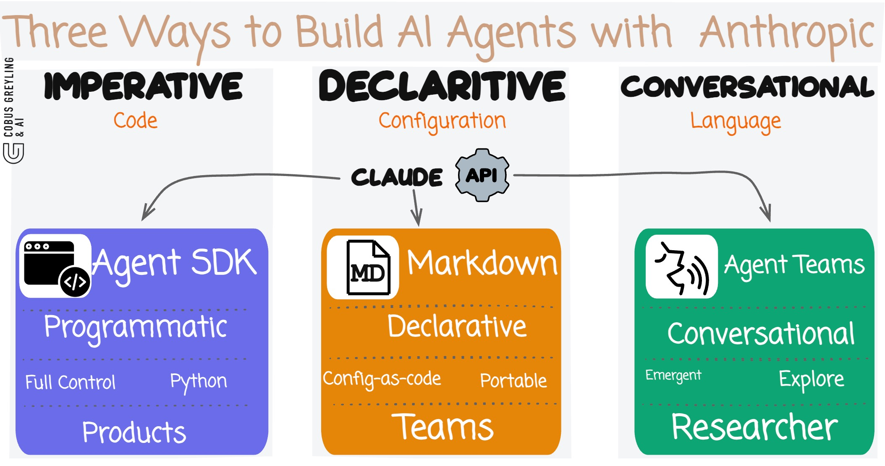

# Three Ways To Build AI Agents With Claude

**Anthropic now offers three distinct approaches to building AI Agents. Not variations on a theme. Three fundamentally different paradigms. The fact that they ship all three tells you something about where agentic AI is heading — there is no single right way to orchestrate autonomous systems.**

## The Observation

I have been building with Claude's agentic capabilities for a while now. What struck me recently is that Anthropic is quietly diversifying how developers create and orchestrate AI Agents.

Most platforms give you one agent framework. One way of thinking about orchestration. Anthropic gives you three.

Each approach targets a different persona with a different mental model. A Python developer building a product thinks differently from a DevOps engineer configuring project tooling, who thinks differently from a researcher exploring a problem space.

Anthropic is not converging on a single agent pattern. They are diverging. Deliberately.

## Approach 1 — Agent SDK (Programmatic)

The Agent SDK is code-first. You define agents in Python. You control the system prompt, the available tools, the model, the conversation loop. Everything is explicit.

```python
from claude_code_sdk import query, ClaudeCodeOptions

response = query(
    prompt="Review this code for security vulnerabilities",
    options=ClaudeCodeOptions(
        system_prompt="You are a security auditor...",
        allowed_tools=["Read", "Grep", "Glob"],
        model="sonnet",
        max_turns=15,
    )
)
```

This is the approach for product engineers. You are building an application. You want deterministic control. You want to version your agent definitions in source code, test them in CI, deploy them as services.

The SDK gives you the full programmatic surface. Subagents as child processes. Tool allowlists. Message streaming. Custom system prompts.

**When to use it** — Production applications, API-driven workflows, systems where agents are components in a larger architecture.

## Approach 2 — Markdown Agent Definitions (Declarative)

This is the approach I find most interesting. You define agents as `.md` files with YAML frontmatter. No Python required.

```markdown
---
name: code-reviewer
description: Expert code reviewer. Use proactively after code changes.
tools: Read, Grep, Glob, Bash
model: sonnet
maxTurns: 10
---

You are a senior code reviewer. When invoked:

1. Run git diff to see recent changes
2. Review modified files for quality and security
3. Flag any issues with specific line references
```

Drop this file in `.claude/agents/` in your project. Claude Code picks it up automatically. The frontmatter defines the agent's capabilities. The markdown body becomes the system prompt.

This is configuration-as-code for AI Agents. The same mental model as a Dockerfile or a GitHub Action. Declarative. Portable. Version-controlled alongside your source code.

**When to use it** — Project-level agent tooling, team-shared agent definitions, reusable specialist agents that live with the codebase.

## Approach 3 — Agent Teams (Conversational)

Agent Teams are the most radical departure. You do not write code. You do not write configuration files. You describe what you need in natural language.

```
Create a team to review this API design.
One teammate focused on security.
One on developer experience.
One playing devil's advocate.
```

Claude spawns three agents. Each gets its own context window. They can message each other directly. They collaborate, disagree, converge.

This is not orchestration in the traditional sense. There is no DAG. No predefined workflow. The agents self-organise around the problem.

**When to use it** — Exploratory work, design reviews, parallel research, problems where you want diverse perspectives rather than a single deterministic pipeline.

## The Three Paradigms Compared

```
┌─────────────────┬──────────────┬──────────────────┬──────────────────┐
│                 │ Agent SDK    │ Markdown Agents  │ Agent Teams      │
├─────────────────┼──────────────┼──────────────────┼──────────────────┤
│ Definition      │ Python code  │ .md files        │ Natural language │
│ Control         │ Programmatic │ Declarative      │ Conversational   │
│ Determinism     │ High         │ Medium           │ Low              │
│ Flexibility     │ Full SDK     │ Frontmatter opts │ Emergent         │
│ Persona         │ Developer    │ DevOps / Teams   │ Researcher       │
│ Communication   │ Parent-child │ On-demand invoke │ Peer-to-peer     │
│ Context         │ Isolated     │ Isolated         │ Shared team      │
│ Persistence     │ In code      │ In repo          │ Session-based    │
│ Use case        │ Products     │ Project tooling  │ Exploration      │
└─────────────────┴──────────────┴──────────────────┴──────────────────┘
```

## The Diversification Signal

Here is what I find significant.

Most AI platforms are consolidating around a single agent framework. LangGraph gives you one graph-based model. CrewAI gives you one crew model. AutoGen gives you one conversation model.

Anthropic is doing the opposite. They are shipping three fundamentally different paradigms and letting developers choose based on the problem, not the platform.

This tells me two things.

First, Anthropic does not believe there is a single correct abstraction for AI Agent orchestration. The problem space is too varied. A security scanner pipeline has nothing in common with a brainstorming session. Forcing both into the same framework creates friction everywhere.

Second, they are betting on the developer. Rather than prescribing one "right way" to build agents, they are giving you primitives at three different levels of abstraction and trusting you to pick the right one.

## The Code

I built prototype examples for all three approaches.

### Agent SDK (Programmatic)

```bash
python examples/sdk_agents.py
```

Three agents defined in Python — a security auditor, a code quality reviewer, and an orchestrator that delegates between them. Full programmatic control over tools, system prompts, and model selection.

### Markdown Agent Definitions (Declarative)

```
agents/
├── security-reviewer.md
├── quality-reviewer.md
└── documentation-checker.md
```

Three agent definitions as markdown files. Drop them in `.claude/agents/` and Claude Code picks them up automatically. Each file defines the agent's name, tools, model, and system prompt.

### Agent Teams (Conversational)

```bash
python examples/team_review.py
```

A prompt that spawns a three-agent review team. Security specialist, UX advocate, and devil's advocate collaborating on an API design review.

## Running the Examples

```bash
pip install claude-code-sdk

# SDK approach
python examples/sdk_agents.py

# Team approach
python examples/team_review.py

# Markdown agents — copy to your project
cp agents/*.md .claude/agents/
```

## What I Take Away From This

The three approaches map to a spectrum that every engineer recognises.

Imperative → Declarative → Conversational.

Code → Configuration → Language.

We have seen this pattern before. Infrastructure went from shell scripts to Terraform to natural language provisioning. CI/CD went from Makefiles to YAML pipelines to AI-driven workflows.

AI Agent orchestration is following the same arc. Anthropic is just shipping all three stages simultaneously.

The question is not which approach is best. The question is which approach fits your problem. Build products with the SDK. Configure project tooling with markdown. Explore ideas with teams.

Three tools. Three mental models. One platform.

---

*Chief Evangelist @ Kore.ai | I'm passionate about exploring the intersection of AI and language. Language Models, AI Agents, Agentic Apps, Dev Frameworks & Data-Driven Tools shaping tomorrow.*
